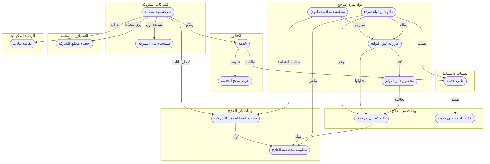

# الخريطة المختصرة للكيانات
<!-- generated from model.json — لا تعدّل يدوياً -->

نظرة عامة بلغة العمل: الكيانات مجمّعة بحسب المجال والعلاقات بينها، بلا حقول أو تفاصيل تقنية. التفاصيل في [[erd|الكيانات والعلاقات]].

## المجالات
- **نواة ثمرة (مرجع)**: [[E-core-farmer|فلاح (من نواة ثمرة)]]، [[E-core-farm|مزرعة (من النواة)]]، [[E-core-crop|محصول (من النواة)]]، [[E-region|منطقة (محافظة/ناحية)]]
- **الشركات الشريكة**: [[E-provider|شركة/جهة مقدّمة]]، [[E-provider-user|مستخدم لدى الشركة]]
- **الكتالوج**: [[E-service|خدمة]]، [[E-offering|عرض/منتج للخدمة]]
- **الطلبات والتشغيل**: [[E-service-request|طلب خدمة]]
- **بيانات من الفلاح**: [[E-farm-report|تقرير/تحليل مرفوع]]، [[E-feedback|تغذية راجعة على خدمة]]
- **بيانات إلى الفلاح**: [[E-region-dataset|بيانات المنطقة (من الشركة)]]، [[E-insight|معلومة مخصصة للفلاح]]
- **التحليلات المجمّعة**: [[E-aggregate|إحصاء مجمّع للشركة]]
- **الرقابة الحكومية**: [[E-data-agreement|اتفاقية بيانات]]
