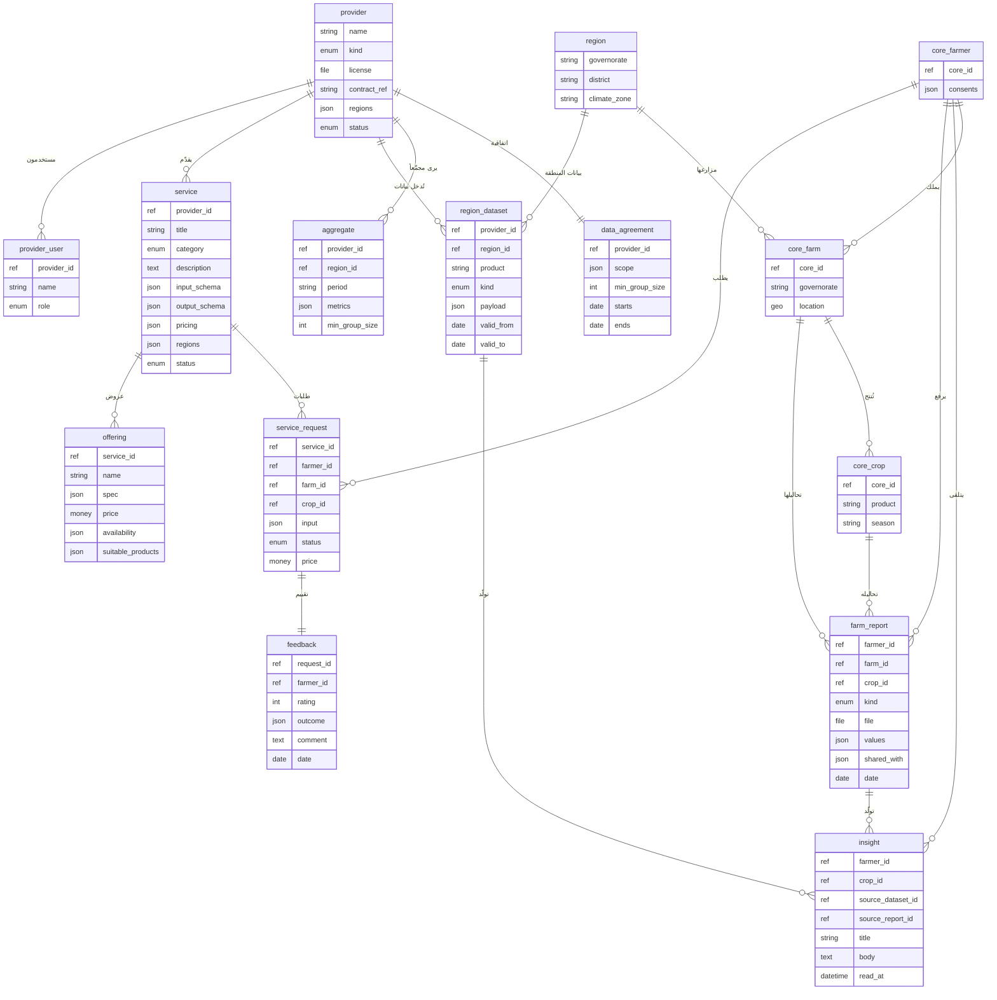

# الكيانات والعلاقات
<!-- generated from model.json — لا تعدّل يدوياً -->

## الكيانات
- [[E-core-farmer|فلاح (من نواة ثمرة)]] (2 حقل)
- [[E-core-farm|مزرعة (من النواة)]] (3 حقل)
- [[E-core-crop|محصول (من النواة)]] (3 حقل)
- [[E-region|منطقة (محافظة/ناحية)]] (3 حقل)
- [[E-provider|شركة/جهة مقدّمة]] (6 حقل)
- [[E-provider-user|مستخدم لدى الشركة]] (3 حقل)
- [[E-service|خدمة]] (9 حقل)
- [[E-offering|عرض/منتج للخدمة]] (6 حقل)
- [[E-service-request|طلب خدمة]] (7 حقل)
- [[E-farm-report|تقرير/تحليل مرفوع]] (8 حقل)
- [[E-feedback|تغذية راجعة على خدمة]] (6 حقل)
- [[E-region-dataset|بيانات المنطقة (من الشركة)]] (7 حقل)
- [[E-insight|معلومة مخصصة للفلاح]] (7 حقل)
- [[E-aggregate|إحصاء مجمّع للشركة]] (5 حقل)
- [[E-data-agreement|اتفاقية بيانات]] (5 حقل)
