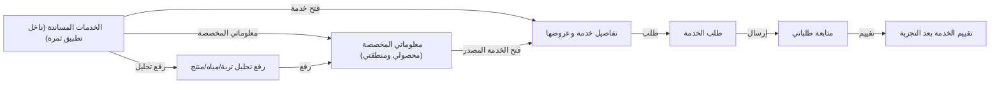

# تدفق شاشات farmer
<!-- generated from model.json — لا تعدّل يدوياً -->

- [[S-farmer-services|الخدمات المساندة (داخل تطبيق ثمرة)]]
- [[S-farmer-service-detail|تفاصيل خدمة وعروضها]]
- [[S-farmer-service-request|طلب الخدمة]]
- [[S-farmer-service-track|متابعة طلباتي]]
- [[S-farmer-feedback|تقييم الخدمة بعد التجربة]]
- [[S-farmer-upload-report|رفع تحليل تربة/مياه/منتج]]
- [[S-farmer-insights|معلوماتي المخصصة (محصولي ومنطقتي)]]
