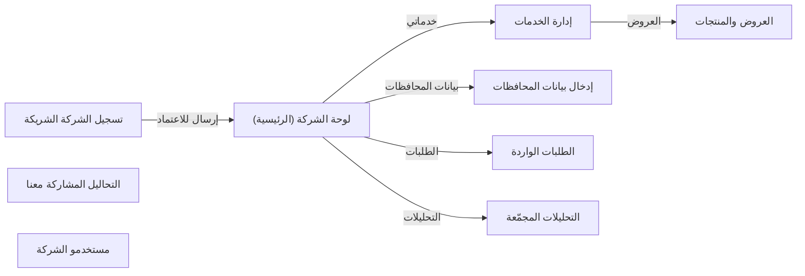

# تدفق شاشات partner
<!-- generated from model.json — لا تعدّل يدوياً -->

- [[S-partner-onboarding|تسجيل الشركة الشريكة]]
- [[S-partner-home|لوحة الشركة (الرئيسية)]]
- [[S-partner-services|إدارة الخدمات]]
- [[S-partner-offerings|العروض والمنتجات]]
- [[S-partner-region-data|إدخال بيانات المحافظات]]
- [[S-partner-requests|الطلبات الواردة]]
- [[S-partner-reports|التحاليل المشاركة معنا]]
- [[S-partner-analytics|التحليلات المجمّعة]]
- [[S-partner-users|مستخدمو الشركة]]
