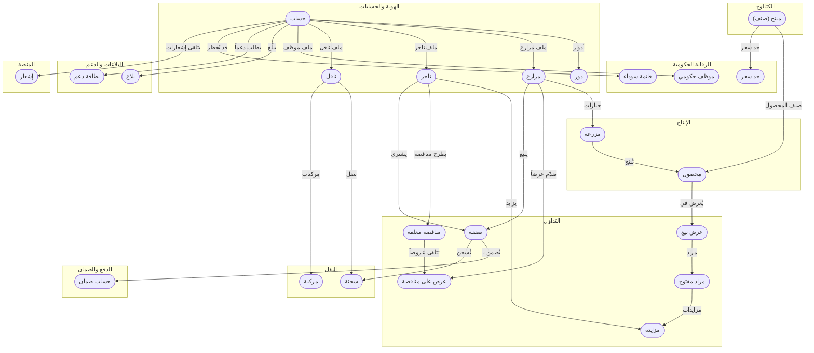

# الخريطة المختصرة للكيانات
<!-- generated from model.json — لا تعدّل يدوياً -->

نظرة عامة بلغة العمل: الكيانات مجمّعة بحسب المجال والعلاقات بينها، بلا حقول أو تفاصيل تقنية. التفاصيل في [[erd|الكيانات والعلاقات]].

## المجالات
- **الهوية والحسابات**: [[E-user|حساب]]، [[E-role|دور]]، [[E-farmer|مزارع]]، [[E-trader|تاجر]]، [[E-transporter|ناقل]]
- **النقل**: [[E-vehicle|مركبة]]، [[E-shipment|شحنة]]
- **الرقابة الحكومية**: [[E-officer|موظف حكومي]]، [[E-price-limit|حد سعر]]، [[E-blacklist|قائمة سوداء]]
- **الإنتاج**: [[E-farm|مزرعة]]، [[E-crop|محصول]]
- **الكتالوج**: [[E-product|منتج (صنف)]]
- **التداول**: [[E-listing|عرض بيع]]، [[E-auction|مزاد مفتوح]]، [[E-bid|مزايدة]]، [[E-tender|مناقصة مغلقة]]، [[E-offer|عرض على مناقصة]]، [[E-order|صفقة]]
- **الدفع والضمان**: [[E-escrow|حساب ضمان]]
- **البلاغات والدعم**: [[E-report|بلاغ]]، [[E-ticket|بطاقة دعم]]
- **المنصة**: [[E-notification|إشعار]]
