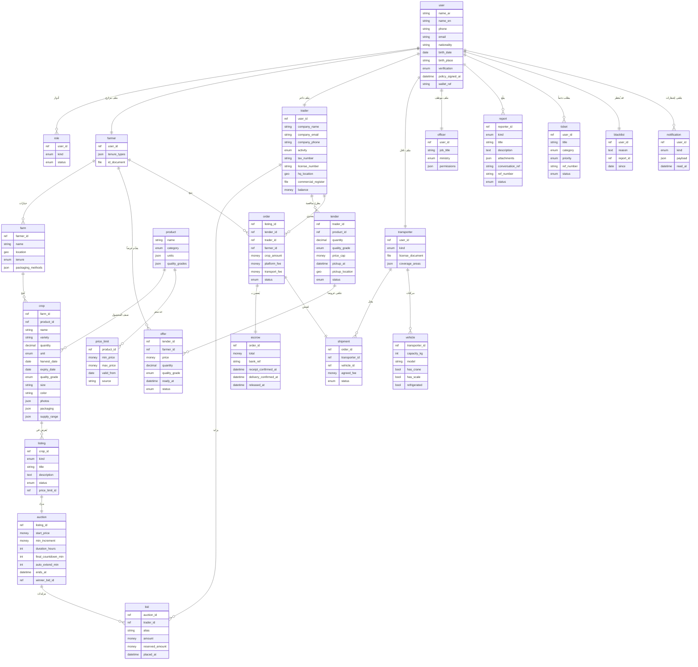

# الكيانات والعلاقات
<!-- generated from model.json — لا تعدّل يدوياً -->

## الكيانات
- [[E-user|حساب]] (10 حقل)
- [[E-role|دور]] (3 حقل)
- [[E-farmer|مزارع]] (3 حقل)
- [[E-trader|تاجر]] (10 حقل)
- [[E-transporter|ناقل]] (4 حقل)
- [[E-vehicle|مركبة]] (6 حقل)
- [[E-officer|موظف حكومي]] (4 حقل)
- [[E-farm|مزرعة]] (5 حقل)
- [[E-product|منتج (صنف)]] (4 حقل)
- [[E-crop|محصول]] (14 حقل)
- [[E-listing|عرض بيع]] (6 حقل)
- [[E-auction|مزاد مفتوح]] (8 حقل)
- [[E-bid|مزايدة]] (6 حقل)
- [[E-tender|مناقصة مغلقة]] (8 حقل)
- [[E-offer|عرض على مناقصة]] (7 حقل)
- [[E-order|صفقة]] (8 حقل)
- [[E-escrow|حساب ضمان]] (6 حقل)
- [[E-shipment|شحنة]] (5 حقل)
- [[E-price-limit|حد سعر]] (5 حقل)
- [[E-blacklist|قائمة سوداء]] (4 حقل)
- [[E-report|بلاغ]] (8 حقل)
- [[E-ticket|بطاقة دعم]] (6 حقل)
- [[E-notification|إشعار]] (4 حقل)
