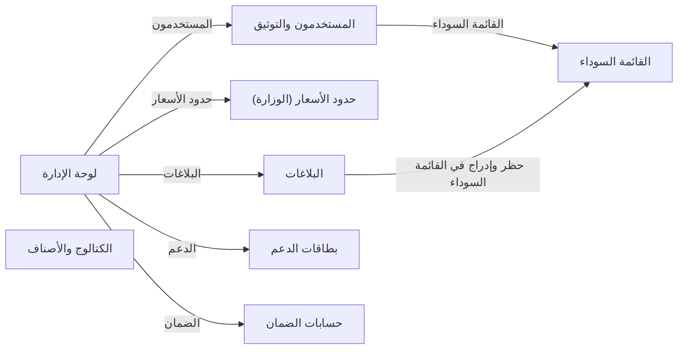

# تدفق شاشات admin
<!-- generated from model.json — لا تعدّل يدوياً -->

- [[S-admin-dashboard|لوحة الإدارة]]
- [[S-admin-users|المستخدمون والتوثيق]]
- [[S-admin-catalog|الكتالوج والأصناف]]
- [[S-admin-price-limits|حدود الأسعار (الوزارة)]]
- [[S-admin-reports|البلاغات]]
- [[S-admin-blacklist|القائمة السوداء]]
- [[S-admin-tickets|بطاقات الدعم]]
- [[S-admin-escrow|حسابات الضمان]]
