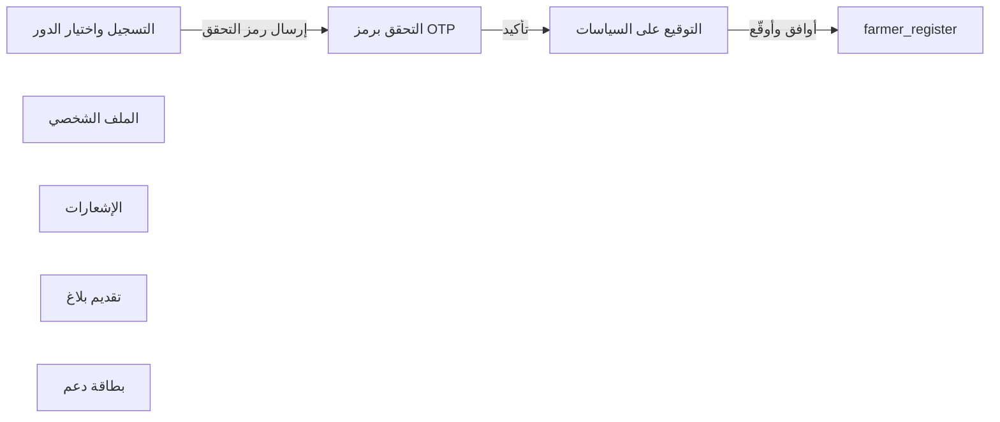

# تدفق شاشات all
<!-- generated from model.json — لا تعدّل يدوياً -->

- [[S-register|التسجيل واختيار الدور]]
- [[S-otp-verify|التحقق برمز OTP]]
- [[S-policy-sign|التوقيع على السياسات]]
- [[S-profile|الملف الشخصي]]
- [[S-notifications|الإشعارات]]
- [[S-report-create|تقديم بلاغ]]
- [[S-ticket-create|بطاقة دعم]]
