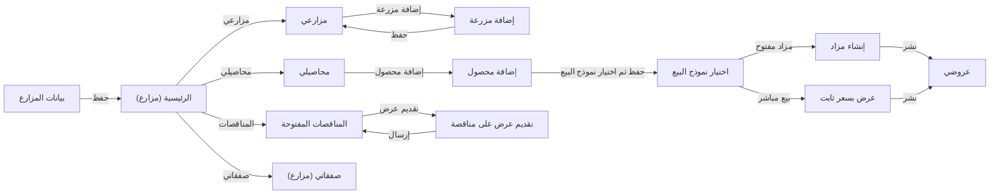

# تدفق شاشات farmer
<!-- generated from model.json — لا تعدّل يدوياً -->

- [[S-farmer-register|بيانات المزارع]]
- [[S-farmer-home|الرئيسية (مزارع)]]
- [[S-farmer-farms|مزارعي]]
- [[S-farmer-farm-add|إضافة مزرعة]]
- [[S-farmer-crops|محاصيلي]]
- [[S-farmer-crop-add|إضافة محصول]]
- [[S-farmer-sell-choose|اختيار نموذج البيع]]
- [[S-farmer-auction-create|إنشاء مزاد]]
- [[S-farmer-fixed-create|عرض بسعر ثابت]]
- [[S-farmer-listings|عروضي]]
- [[S-farmer-tender-browse|المناقصات المفتوحة]]
- [[S-farmer-offer-submit|تقديم عرض على مناقصة]]
- [[S-farmer-orders|صفقاتي (مزارع)]]
