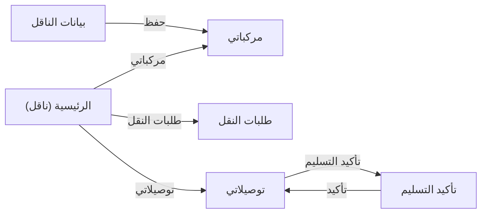

# تدفق شاشات transporter
<!-- generated from model.json — لا تعدّل يدوياً -->

- [[S-transporter-register|بيانات الناقل]]
- [[S-transporter-home|الرئيسية (ناقل)]]
- [[S-transporter-vehicles|مركباتي]]
- [[S-transporter-requests|طلبات النقل]]
- [[S-transporter-deliveries|توصيلاتي]]
- [[S-transporter-confirm-delivery|تأكيد التسليم]]
